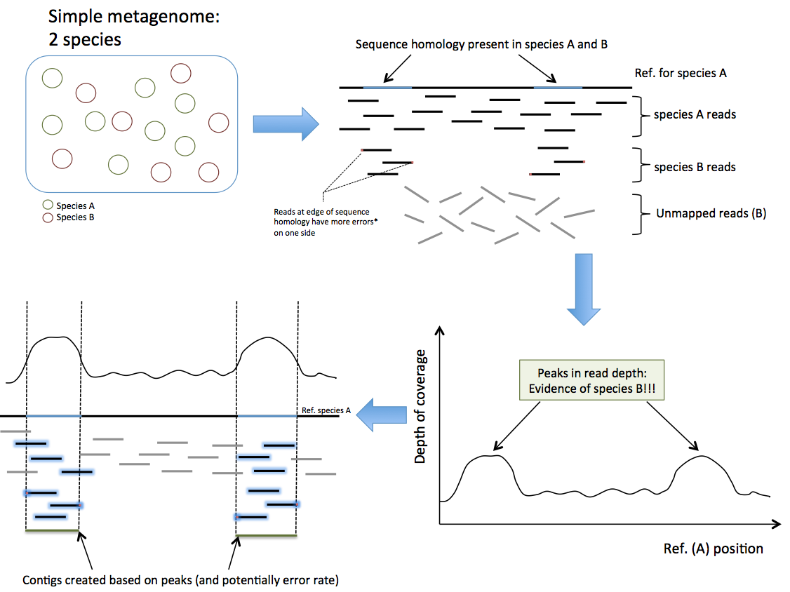

<h1>Omniscope</h1>

Omniscope is a metagenomics project (currently under development) that combines reference-based profiling with de novo assembly techniques to maximise the number of used reads and discover novel species that are not identified through reference-based methods.

[See our recent poster](https://figshare.com/articles/OmniScope_a_Computational_Pipeline_for_Metagenomic_Species_Identification_Using_Reference_and_de_novo_Assembly/5466553)

The project is organised around two key stages:

<h2>Sequence Discovery By Homology</h2>

In this first stage, we take advantage of the homologous sequences that exists between distinct (but related) species. Given a pair of related species and only one available reference genome, we found that homologous sequences form detectable peaks in coverage as reads from both species map to the available reference. This "excess coverage" provides the starting point for a directed de novo assembly with the creation of initial contigs spanning these regions. The following figure illustrates the concept behind this stage with a simple hypothetical 2-species metagenome:

We tested this concept by simulating reads from E.coli and C.condimenti genomes and mapping them to the E.coli as a reference genome:

The latter figure shows reads from C.condimenti mapping to various regions of the E.coli reference genome. We expect a subset of these regions to form detectable peaks when reads from both E.coli and C.condimenti as shown in the two following graphs.

To give a better sense of what the individual peaks look like, the highlighted region from the previous figure is shown below:

<h2>Directed De Novo Assembly</h2>

In this second stage, the previously assembled contigs are used to perform directed de novo assemblies of the corresponding species. We construct a De Bruijn graph from the remaining unmapped reads and store it in a Bloom filter (i.e. not mapped to a reference or part of an initial contig). Using either end of an available contigs, we extend our contigs by querying the Bloom filter until they can no longer be extended or connect to another contig. This step is repeated until every contig has been extended as much as possible.

This project, originally conceived as an extension to Pathoscope 2.0, will also work with output from other reference-based programs provided the output is in SAM/BAM format.
